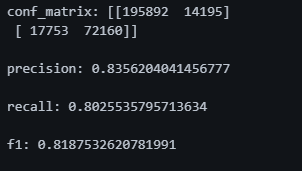
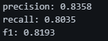

<h1 align="center">Loan Approval ML System</h1>
<h2>Project Description</h2>
This project solves the problem of binary classification - whether to approve a loan or not.
<p>
The system takes customer data, processes it through a calendar preprocessing and makes a decision:
<ul>
<li>✅ Approved</li>
<li>❌ Is not approved</li>
</ul>
</p>

<h2>Source characteristics:</h2>
```
Applicant_Income: float
Coapplicant_Income: float
Employment_Status: ["Salaried", "Contract", "Unemployed", "Self-employed"]
Age: float
Marital_Status: ["Married", "Single"]
Dependents: int
Credit_Score: float
Existing_Loans: int
DTI_Ratio: float
Savings: float
Collateral_Value: float
Loan_Amount: float
Loan_Term: float
Loan_Purpose: ["Car", "Home", "Personal", "Education", "Business"]
Property_Area: ["Rural", "Urban", "Semiurban"]
Education_Level: ["Not Graduate", "Graduate"]
Gender: ["Male", "Female"]
```

<h2>Feature Engineering</h2>
<p>
The project implements a DataPreprocessor caste class that performs data preparation.
</p>
<p>
Used as Pipeline:
The class is designed as a pre-trained preprocessing pipeline that can be applied to new data before it is submitted to the model. This ensures:
</p>
<p>
Uniform Feature Processing
Generation of new, informative cues
Convert categorical and order data
Data preparation for the model in production mode
</p>
<p>
This way, DataPreprocessor can be easily integrated into API or other ML-PIPs to automatically preprocess customers' input data before forecasting.
</p>
<h3>Generated Traits</h3>
<ul>
<li>total_income - total income</li>
<li>approximate_loan_amount - adjusted loan size</li>
<li>payment_capacity - customer’s ability to pay</li>
<li>collateral_ratio - ratio of collateral to credit</li>
<li>income_to_loan - ratio of income to loan amount</li>
<li>risk_score - customer risk</li>
</ul>
<h3>Character encoding</h3>
<ul>
<li>One-Hot Encoding:</li>

>["Marital_Status", "Education_Level", "Gender", "Loan_Purpose"]
<li>Ordinal Encoding:</li>

>Property_Area: ["Rural", "Semiurban", "Urban"]
<li>Target Encoding:</li>

>Employment_Status
</ul>
<h3>Final set of traits</h3>

>[
    'Applicant_Income', 
    'Coapplicant_Income', 
    'Employment_Status', 
    'Age', 
    'Dependents', 
    'Credit_Score', 
    'Existing_Loans', 
    'DTI_Ratio', 
    'Savings', 
    'Collateral_Value', 
    'Loan_Amount', 
    'Loan_Term', 
    'Property_Area', 
    'total_income', 
    'approximate_loan_amount', 
    'payment_capacity', 
    'collateral_ratio', 
    'income_to_loan', 
    'risk_score', 
    'Marital_Status_Married', 
    'Marital_Status_Single', 
    'Education_Level_Graduate', 
    'Education_Level_Not Graduate', 
    'Gender_Female', 
    'Gender_Male', 
    'Loan_Purpose_Business', 
    'Loan_Purpose_Car', 
    'Loan_Purpose_Education', 
    'Loan_Purpose_Home', 
    'Loan_Purpose_Personal' 
    ]
<p>
Also to correct the imbalance of classes, I used SMOTE, which was able to raise the value of the metric complex by 3-5 percent.
</p>
<h2>Model</h2>
<h3>Experiments have been conducted between models:</h3>
<ul>
<li>Linear Regression</li>
<li>SVM</li>
<li>Random Forest</li>
<li>Gradient Boosting</li>
</ul>
<p>The best score was in the gradient busting model - XGBClassifier</p>
<p>For the main metric was selected: PR-AUC</p>

<h3>Model scores:</h3>

><p><b>PR-AUC</b></p>
>

><p><b>Secondary metrics</b></p>
>

><p><b>PR-AUC for stratified cross vallidation</b></p>
>

><p><b>Secondary metrics for stratified cross vallidation</b></p>
>

<h2>API</h2>
<p>Model wrapped in FastAPI service:</p>
<p>Endpoint:</p>

```python
POST /loan_approval
```
<p>Пример ответа</p>

```
{
  "response": "Approved"
}
```

<h2>Monitoring</h2>
<h3>Implemented through:</h3>
<p>Prometheus</p>
<ul>
<li>Request Processing Time (REQUEST_TIME)</li>
<li>Total requests (TOTAL_REQUEST)</li>
<li>Class allocation (CLASS_ALLOCATION)</li>
</ul>
<p>Grafana</p>
<ul>
<li>Visualize your metric in real time</li>
</ul>

<h2>ML Lifecycle</h2>

>MLflow - experiment logic, model storage and metrics
>DVC - Manage data and model versions
>S3 (MinIO) - storage:
<ul>
<li>Models</li>
<li>Preprocessors</li>
<li>The artifacts of experiments</li>
</ul>

<h2>Docker and Infrastructure</h2>
<p>Project fully containerized.</p>
<h3>Services:</h3>
<ul>
<li>app - API with model</li>
<li>mlflow - experiment tracking</li>
<li>pg_db_mlflow - MLflow database</li>
<li>minio3 - S3 Storage</li>
<li>minio3_setup - Car-Build Boxes</li>
<li>prometheus - collection of metrics</li>
<li>grafana - visualization</li>
</ul>

<h2>S3 Auto Setup</h2>
<p>When minio3_setup is run:</p>
<h4>Create:</h4>
<ul>
<li>mlflow</li>
<li>mlflow/artifacts</li>
<li>inference bucket</li>
</ul>
<p>If already there are chips, they are not re-created</p>

<h2>Future Enhancements</h2>
<p>
In the future, the project can be expanded to fully automate online approval when applying for a loan. Possible improvements:
</p>

Automatically retrieve customer history:
<ul>
<li>Current and past loans</li>
<li>Debt and overdue information</li>
<li>Average monthly income and official salary</li>
<li>history of payments on other financial obligations</li>
</ul>

Automatic customer pre-scoring:
<ul>
<li>Credit rating calculation</li>
<li>Assessment of solvency</li>
<li>prediction of default risk</li>
</ul>

<p>
These improvements will reduce manual labor, speed decision-making, and improve risk assessment accuracy, ensuring quick and safe credit disbursement.
</p>